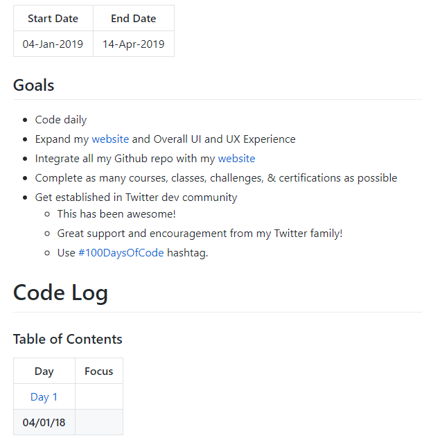
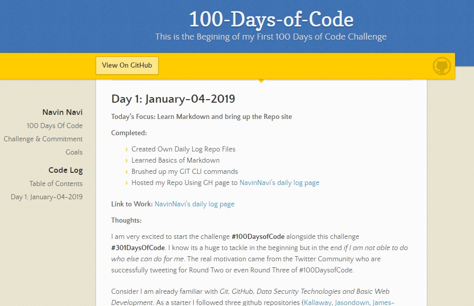

# Navin Navi

## 100 Days Of Code

| Log |
| --- |
| [this log](README.md) |

## Challenge & Commitment
This is part of Alexander Kallaway's [100DaysOfCode](https://github.com/Kallaway/100-days-of-code "the official repo") challenge. More details about the challenge can be found here: [100daysofcode.com](http://100daysofcode.com/ "100daysofcode.com").

**Commitment:** *I will code daily for the next 100 days.*

|  Start Date   | End Date     |
| ------------- | ------------ |
|  04-Jan-2019  |  14-Apr-2019 |

## Goals

- Code daily
- Expand my [website](https://vanuss.in/) and Overall UI and UX Experience
- Integrate all my Github repo with my [website](https://vanuss.in/)
- Complete as many courses, classes, challenges, & certifications as possible
- Get established in Twitter dev community
  - This has been awesome!
  - Great support and encouragement from my Twitter family!
  - Use [#100DaysOfCode](https://twitter.com/search?q=%23100DaysOfCode&src=tyah) hashtag.

# Code Log

### Table of Contents 

| **Day** | **Focus** | **Day** | **Focus** |
|:---:|:-----:|:---:|:-----:|
|[Day 1](#day-1) **04/01/19**| Learn Markdown and bring up the Repo site |[Day 2](#day-2) **05/01/19**| Automation In my Web Server Part 1 |
|[Day 3](#day-3) **06/01/19**| Automation In my Web Server Part 2 | [Day 4](#day-4) **07/01/19**| Learn-Website-Hacking-Penetration-Testing-From-Scratch |
|[Day 5](#day-5) **08/01/19**| Virtual Lab Setup |[Day 6](#day-6) **09/01/19**| Pico CTF 2017 | 
|[Day 7](#day-7) **10/01/19**| Pico CTF 2017|[Day 8](#day-8) **11/01/19**| Pico CTF 2017|
|[Day 9](#day-9) **12/01/19**| Busy Day|[Day 10](#day-10) **13/01/19**| Pico CTF 2017|
| [Day 11](#day-11) **14/01/19**| Learn-Website-Hacking-Penetration-Testing-From-Scratch |[Day 12](#day-12) **15/01/19**| Learn-Website-Hacking-Penetration-Testing-From-Scratch |
| [Day 13](#day-13) **16/01/19**| Learn-Website-Hacking-Penetration-Testing-From-Scratch |[Day 14](#day-14) **17/01/19**| Pico CTF 2017|
[Day 15](#day-15) **18/01/19**| Pico CTF 2017|[Day 16](#day-16) **19/01/19**| Pico CTF 2017|
| [Day 17](#day-17) **20/01/19**| Learn-Website-Hacking-Penetration-Testing-From-Scratch |[Day 18](#day-18) **21/01/19**| Quality of life Improvements |
| [Day 19](#day-19) **22/01/19**| The Web Developer Bootcamp - Till Bootstrap |[Day 20](#day-20) **23/01/19**| The Web Developer Bootcamp - Till Javascript last project |
|[Day 21](#day-21) **24/01/19**| The Web Developer Bootcamp - jQuery |[Day 22](#day-22) **25/01/19**| The Web Developer Bootcamp - jQuery |
|[Day 23](#day-23) **26/01/19**| The Web Developer Bootcamp - Advanced jQuery |[Day 24](#day-24) **27/01/19**| The Web Developer Bootcamp - jQuery - ToDo List Project |
|[Day 25](#day-25) **28/01/19**| VANUSS - 2nd Post Preparation |

<!-- ---

## Day : January--2019

#### Today's Focus: 

#### Completed:

#### Link to Work:

#### Thoughts: 

[Table of Contents](#toc) -->

 ---

## Day 25: January-28-2019

#### Today's Focus: VANUSS - 2nd Post Preparation

#### Completed: 
- Completed writing 2nd post.
- Updated the same in my dev site.
- Did some quality of life improvements. 

[Table of Contents](#toc)

---

## Day 24: January-27-2019

#### Today's Focus: The Web Developer Bootcamp - jQuery
#### Completed:
- Halfway through ToDo List Project using jQuery

#### Link to Work: [The-Web-Developer-Bootcamp-Github](https://github.com/NavinNavi19/The-Web-Developer-Bootcamp)

---

## Day 23: January-26-2019

#### Today's Focus: The Web Developer Bootcamp - jQuery
#### Completed:
- Learned click() event
- Learned on() event
- Learned keypress() event
- Learned fadeOut(), fadeIn and fadeToggle effect
- Learned slideOut(), slideIn and slideToggle effect
- Learned remove() method

#### Link to Work: [The-Web-Developer-Bootcamp-Github](https://github.com/NavinNavi19/The-Web-Developer-Bootcamp)

---

## Day 22: January-25-2019

#### Today's Focus: The Web Developer Bootcamp - jQuery
#### Completed:
- Completed jQuery Basics

#### Link to Work: [The-Web-Developer-Bootcamp-Github](https://github.com/NavinNavi19/The-Web-Developer-Bootcamp)

---

## Day 21: January-24-2019

#### Today's Focus: The Web Developer Bootcamp - jQuery
#### Completed:
- jQuery Basics

#### Link to Work: [The-Web-Developer-Bootcamp-Github](https://github.com/NavinNavi19/The-Web-Developer-Bootcamp)

---

## Day 20: January-23-2019

#### Today's Focus: The Web Developer Bootcamp - Till Javascript last project

#### Completed:
- Revised till JavaScript and Color Game Project. Need to start JQuery.

#### Link to Work: [The-Web-Developer-Bootcamp-Github](https://github.com/NavinNavi19/The-Web-Developer-Bootcamp)

 ---

## Day 19: January-22-2019

#### Today's Focus: The Web Developer Bootcamp - Till Bootstrap

#### Completed:
- Revised half of the course which I stopped one month back

#### Link to Work: [The-Web-Developer-Bootcamp-Github](https://github.com/NavinNavi19/The-Web-Developer-Bootcamp)

[Table of Contents](#toc) 

---

## Day 18: January-21-2019

#### Today's Focus: Quality of life Improvements

#### Completed:

+ Key based login to github
+ Key based login webserver
+ Automated some repeated basic commands with scripts
+ Automate git commands with scripts to run in fixed interval using crontab.

#### Thoughts: 

Today's work will save me a lot of time in future sessions because no more entering passwords for git push and pull. ssh agents are automated to save the passphare. Lot learned today in git and linux scripting.

[Table of Contents](#toc)

---

## Day 17: January-20-2019

#### Today's Focus: Learn-Website-Hacking-Penetration-Testing-From-Scratch

#### Completed:

- Learned Burp Suite Basic Web Traffic Analysis 

#### Link to Work: [Notes](https://github.com/NavinNavi19/Learn-Website-Hacking-Penetration-Testing-From-Scratch)

[Table of Contents](#toc) 

---

## Day 16: January-19-2019

#### Today's Focus: Pico CTF 2017

#### Completed:
- Radare 2 Tool Basics Learned

#### Link to Work: [Pico CTF WriteUp](https://github.com/NavinNavi19/Pico-CTF-2017-Write-Up)

[Table of Contents](#toc)

---

## Day 15: January-18-2019

#### Today's Focus: Pico CTF 2017

#### Completed:
- Level 2 - 2 Challenges

#### Link to Work: [Pico CTF WriteUp](https://github.com/NavinNavi19/Pico-CTF-2017-Write-Up)

[Table of Contents](#toc)

---

## Day 14: January-17-2019

#### Today's Focus:  Pico CTF 2017

#### Completed: 
- Level 1 
- Level 2 - 3 Challenges

#### Link to Work: [Pico CTF WriteUp](https://github.com/NavinNavi19/Pico-CTF-2017-Write-Up)

[Table of Contents](#toc) 

---

## Day 13: January-16-2019

#### Today's Focus: Learn-Website-Hacking-Penetration-Testing-From-Scratch

#### Completed:

- Dirb and Maltego tool explored

#### Link to Work: [Notes](https://github.com/NavinNavi19/Learn-Website-Hacking-Penetration-Testing-From-Scratch)

[Table of Contents](#toc) 

---

## Day 12: January-15-2019

#### Today's Focus: Learn-Website-Hacking-Penetration-Testing-From-Scratch

#### Completed:

-  Information Gathering

#### Link to Work: [Notes](https://github.com/NavinNavi19/Learn-Website-Hacking-Penetration-Testing-From-Scratch)

[Table of Contents](#toc) 

---

## Day 11: January-14-2019

#### Today's Focus:  Learn-Website-Hacking-Penetration-Testing-From-Scratch

#### Completed:

- Kali Linux Basics
- Website Basics

#### Link to Work: [Notes](https://github.com/NavinNavi19/Learn-Website-Hacking-Penetration-Testing-From-Scratch)

[Table of Contents](#toc) 

---

## Day 10: January-13-2019

#### Today's Focus: Pico CTF

#### Completed:
- 3 Challenges
#### Link to Work: [Pico CTF WriteUp](https://github.com/NavinNavi19/Pico-CTF-2017-Write-Up)

[Table of Contents](#toc)

---

## Day 9: January-12-2019

#### Today's Focus: Busy day

#### Completed: Literally No Coding Except #200Wad

####  Thoughts: Have to catch up tomorrow.

[Table of Contents](#toc)

---

## Day 8: January-11-2019

#### Today's Focus: Pico CTF 2017 

#### Completed:
Learned Regular Expression, SSH, chmod File Permissions

#### Link to Work: [Pico CTF WriteUp](https://github.com/NavinNavi19/Pico-CTF-2017-Write-Up)

[Table of Contents](#toc)

 ---

## Day 7: January-10-2019

#### Today's Focus: Pico CTF 2017 

#### Completed:
- Internet Kitties
- Paizza
- Keyz
#### Link to Work: [Pico CTF WriteUp](https://github.com/NavinNavi19/Pico-CTF-2017-Write-Up)

[Table of Contents](#toc)

---

## Day 6: January-09-2019

#### Today's Focus: Pico CTF 2017 

#### Completed:  3 Tutorials

#### Link to Work: [Repo](https://github.com/NavinNavi19/Pico-CTF-2017-Write-Up)

#### Thoughts: 

Started to play CTF to improve practicle knowledge in security.

[Table of Contents](#toc)

---

## Day 5: January-08-2019

#### Today's Focus: "Virtual Lab Setup"

#### Completed:

- All the Lab Machines has been upgraded to the latest version.
- Snapshots Taken

#### Link to Work: [The Lab](https://github.com/NavinNavi19/Learn-Website-Hacking-Penetration-Testing-From-Scratch/blob/master/Supporting%20Documents/The-Lab.md)

#### Thoughts: 

[Keeweb](https://keeweb.info/) - Free cross-platform password manager compatible with KeePass files and it's light weight accessible from browser. IMO this is the best password manager that I came across.

[Tusk](https://github.com/subdavis/Tusk) - For accessing keePass files from the extension but the need for it is less as manual copy pasting is preferred.

Always Revisit your Google Security to revoke some of the apps access that you don't use anymore.

GitHub gave free access to Private Repositories.

[Table of Contents](#toc)

---

## Day 4: January-07-2019

#### Today's Focus: "Learn-Website-Hacking-Penetration-Testing-From-Scratch"

#### Completed:

 - Created the Lab

#### Link to Work: **[Learn-Website-Hacking-Penetration-Testing-From-Scratch](https://github.com/NavinNavi19/Learn-Website-Hacking-Penetration-Testing-From-Scratch)**

#### Thoughts: 

**Link to Today's Notes :** [The Lab](https://github.com/NavinNavi19/Learn-Website-Hacking-Penetration-Testing-From-Scratch/blob/master/Supporting%20Documents/The-Lab.md)

Found a way to quickly edit github markdown files right from the browser using [**stackedit.io**](https://stackedit.io). Also used [PDF to Markdown Converter](http://pdf2md.morethan.io/) to convert some PDF files.

[Table of Contents](#toc) 

---

## Day 3: January-06-2019

#### Today's Focus: "Automation In my Web Server Part 2"

#### Completed:

+ Set up custom 404 Error page built to suit my website colors. 
+ Learned a lot of bash coding in trying to fix some errors.

#### Link to Work: [Custom 404 Page](https://vanuss.in/404.shtml) 

#### Thoughts: 

It's a Sunday, so most of the time was spent playing and shopping. As I had a prior plan, I managed to code for 2 hours. But unfortunately, I cannot upload my code to my github repo as I have been coding in my web server. First thing today, created a local git and tried to link it with [**my github account**](https://github.com/NavinNavi19), but I was unable to do it. Tried hard to find a way but I dont have enough time in the planned 2 hours to sit and waste time in this.

Turns out that I dont have enough privileges to my shared web hosting server. Most of the commands were not allowed. After some retries, I gave up my goal and had to look for the alternative's whichever is possible. I was not able to update the ruby version too. The sad part is that I spent most of the time trying to do that.

But finally, when i was reading the cpanel documentation to know more about my privileges to the web server, I came across a [**post**](https://support.hostgator.com/articles/cpanel/custom-error-pages) which helped me to setup [**custom error page**](https://vanuss.in/404.shtml) to my website. As I have already prepared my own 404 page design in Dec. I used the post as a guide to edit .htaccess file to enter some lines of code and uploaded my html file to bring up the custom error page instead of a default page which was looking bad.

After this, I came across a valuable post about time management techniques. [**Pomodoro Timer**](https://pomodoro-tracker.com/) for increasing the prouctivity and [**GTD**](https://lifehacker.com/productivity-101-a-primer-to-the-getting-things-done-1551880955)(Get Things Done) for planning the things to be done one by one. After going through some videos about them, I was made to believe that this technique might increase the productivity and I did. One more useful link - [**Hack your To do list**](https://lifehacker.com/5986867/david-allen-explains-how-to-master-your-to-do-list)

To do for the next day:
- Add DNSSEC to my Hosting
- Find a way to fix the git errors and ssh via aws.
- Generate the CSR for new Certificate for Secure connection to [**my website**](https://vanuss.in/).

[Table of Contents](#toc)

 ---

## Day 2: January-05-2019

#### Today's Focus: "Automation In my Web Server Part 1"

#### Completed:
+ Connected to my web server via SSH using keys.
+ Added push notification via api's access token.

#### Link to Work: [My Site](https://vanuss.in/)

#### Thoughts:

Today has been a very busy day. Early morning Cricket, no proper sleep, Outing and Buffet Treat though I managed to find two hours to code.  

As per my plan, I connected to my web server with username and password using putty. But the real problem arises when I try to import keys to connect automatically without any authentication. But I managed to uploade the keys in the respective servers after 30 min of struggle. First part was done as I connected to my server using SSH successfully.

Then I came across a section where it says that I can get notification in my device when any change was done to the server. For that I need to install [**PushBullet**](https://www.pushbullet.com/) to get the access token which is supported. For that I learned basics of [**API**](https://docs.pushbullet.com/) specially flavoured for [**PushBullet**](https://www.pushbullet.com/), then I had to installed [**CURL**](https://curl.haxx.se/) using [**CHOCOLATEY(Package Managers)**](https://chocolatey.org/) in my server to learn about API. 

*[curl -u <your_access_token_here>: https://api.pushbullet.com/v2/users/me]*

Above was the first command I learned to get the details of my API linked user details. This took me almost 20 min to find the exact code. Funny right but thats true. In the end, I found the answer in [**Stack Overflow**](https://stackoverflow.com/) as always.

Finally, Added access token in my server to get the notification in my device

To Do :
- Add DNSSEC to my Hosting
- Try to update cpanel Version and utilize all the features.
- Generate the CSR for new Certificate for Secure connection to [**my website**](https://vanuss.in/).

[Table of Contents](#toc)

---

## Day 1: January-04-2019

#### Today's Focus: "Learn Markdown and bring up the Repo site"

#### Completed: 
+ Created Own Daily Log Repo Files
+ Learned Basics of Markdown
+ Brushed up my GIT CLI commands
+ Hosted my Repo Using GH page to [NavinNavi's daily log page](https://navinnavi19.github.io/100-Days-of-Code/)

#### Link to Work: [NavinNavi's daily log page](https://navinnavi19.github.io/100-Days-of-Code/)

#### Thoughts:

I am very excited to start the challenge [**#100DaysofCode**](https://twitter.com/search?q=%23100DaysOfCode) alongside this challenge [**#301DaysOfCode**](https://twitter.com/search?q=%23301DaysOfCode&src=tyah). I know its a huge to tackle in the beginning but in the end *if I am not able to do who else can do for me*. The real motivation came from the Twitter Community who are successfully tweeting for Round Two or even Round Three of #100DaysofCode.

Consider I am already familiar with *Git, GitHub, Data Security Technologies and Basic Web Development*. As a starter I followed three github  repositories ([Kallaway](https://github.com/kallaway/100-days-of-code), [Jasondown](https://github.com/jasondown/100-days-of-code), [James-Priest](https://github.com/james-priest/100-days-of-code-log)) to created my own [**Daily Log Repo**](https://github.com/NavinNavi19/100-Days-of-Code). I did not directly fork the repo because I decided to learn the markdown language on my own. A quick **brushup of markdown** is covered in this [**Cheatsheet**](https://github.com/adam-p/markdown-here/wiki/Markdown-Cheatsheet).

I imported some of my old local git files using CLI to GitHub faced some small problems but this [**link**](https://help.github.com/articles/adding-an-existing-project-to-github-using-the-command-line/)
helped me to brush up *git CLI remote pull/push commands*.

After some testing with my [**Template Repo**](https://navinnavi19.github.io/Collection-of-Templates/) using this [**post**](https://nicolas-van.github.io/easy-markdown-to-github-pages/) as a reference. Finally, I learned to quickly host my [**Site**](https://navinnavi19.github.io/100-Days-of-Code/) UP with github pages using Jekyll Theme by [Mattgraham](https://twitter.com/mattgraham).

**Day 1 Overview of Images**

[Table of Contents](#toc)
<!--stackedit_data:
eyJoaXN0b3J5IjpbLTMyNTI2MjQ3LDk3MDk0MzI0MSwxOTYyOD
U3NDgyLC0xOTIwODU3MzgyLC0xOTgwNzQwNDc1LDE0MTE1NTIz
ODUsLTE0OTY0ODExOTAsNjgyMTg5NzMxLC00NjQwMzM2MDksMT
Q1NTI3MjMyOSwtMTQ1ODgxMzU3NywxMzcyMTgyMDk4LDE1Mzc0
OTgxNDksNTg1MDc4MzczLDE0NDQ4NzAzODEsMTM1ODQyMzczNy
wtMTYwNTc3MTU3MCwtNDAxMjM0MzA0LC04Mzg4NjYzNDIsMTc3
NzMyOTY3NF19
-->